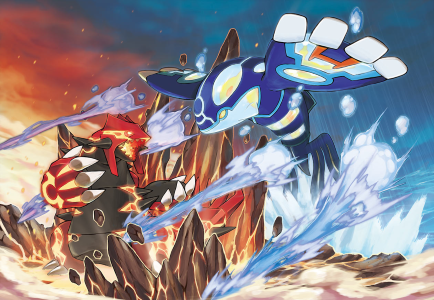
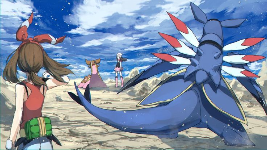

# Pokémon Battle Simulator 🐾

A **3-player Pokémon battle simulator** built in Python with AI support. Players connect as clients to a central server, draft teams, and battle in a turn-based system featuring a GUI with static battle scenes and a scrolling text log.

---

## Features

- **Multiplayer Gameplay**: Up to 3 players connect to a single server  
- **Team Draft**: Players take turns selecting 3 Pokémon before the fight  
- **GUI Interface**: Static battle scene images with a scrolling narration panel  
- **Multiple Battle Scenes**: Different visuals depending on context  
- **Smart Bot (Chat AI)**: In-game assistant to answer questions and offer suggestions  
- **Persistence**: Local database/files for storing queries and other data  

---

## Getting Started

1. **Clone the Repository**  
   Run: `git clone https://github.com/alex19088/Pokemon-Battle-Simulator.git`  
   Then: `cd Pokemon-Battle-Simulator`  

2. **Start the Server**  
   Run: `python server.py`  

3. **Launch Clients**  
   Run: `python clientGUI.py` (three times, or on three different machines).  
   Each client will connect, prompt for a name, and wait in the lobby.  

4. **Draft & Battle**  
   Players select 3 Pokémon each, then the match begins. Actions are chosen through the GUI while a scrolling text box narrates the fight.  

**Prerequisites**: Python 3.x and any libraries in `requirements.txt` (install with `pip install -r requirements.txt`).  

---

## Project Structure

- `server.py` — Manages connections, turns, and battle flow  
- `clientGUI.py` — GUI client for players  
- `PokemonObjects5.py` — Defines Pokémon, moves, and mechanics  
- `chatbot2.py` — AI chatbot assistant  
- `pokemon_battle.db` — Local persistence for queries/info  
- `battle*.png` — Image assets for battle scenes  
- `queries.json` — Stores chatbot queries/logs  

---

## Screenshots

  
  

---

## Tech Stack

- Python 3  
- Tkinter/Pygame (GUI)  
- SQLite / JSON (storage)  
- Custom chatbot  

---

## Roadmap

- Animated battle sequences  
- Expanded Pokémon roster and movesets  
- Smarter AI opponent logic  
- Improved UX (error handling, reconnects)  
- Web or packaged release  

---

## Author

Created by [alex19088](https://github.com/alex19088).  
